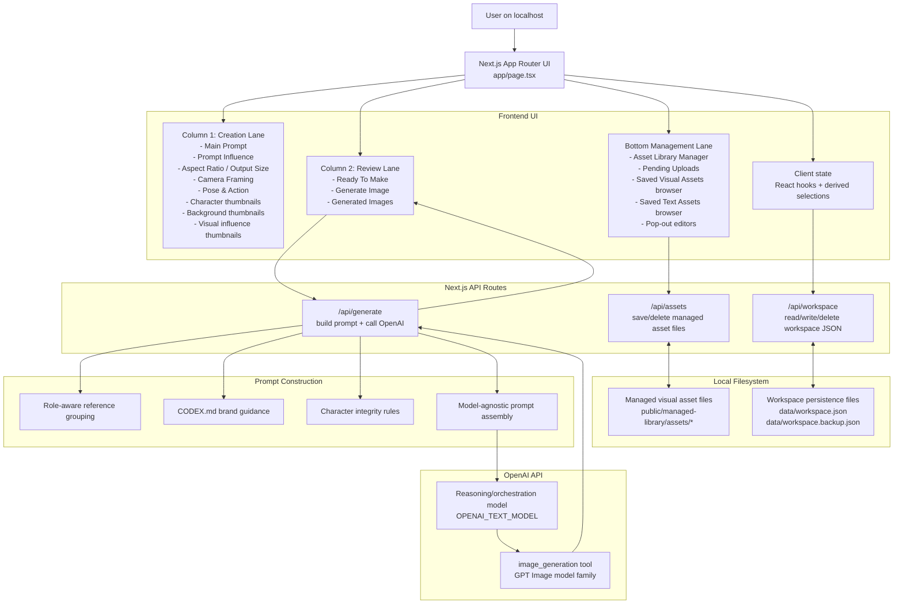
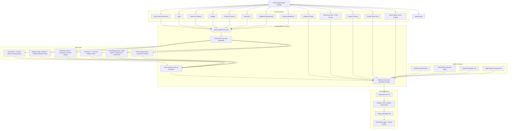

# GVC Content Studio Architecture

## Purpose

`GVC Content Studio` is a local-first content generation app designed to:

- manage a Good Vibes Club-inspired visual asset library
- manage reusable text prompt assets
- build high-quality, brand-consistent prompt packages
- send structured generation requests to OpenAI
- preserve saved assets locally on disk instead of depending on browser blob storage

The architecture is intentionally moving toward:

- stronger brand consistency
- higher quality asset handling
- model-agnostic prompt construction
- safer local persistence

## High-Level Flow

## Frontend Architecture

The main application UI lives in:

- [app/page.tsx](/C:/Users/Laina/Documents/Codex/2026-04-27/i-want-to-build-a-custom/gvc-content-studio/app/page.tsx)

The UI is split into 3 functional areas.

### 1. Creation Lane

The left column is optimized for fast scene assembly.

It contains:

- `Main Prompt`
- `Prompt Influence` dropdown
- `Aspect Ratio`
- `Output Size`
- `Camera Framing`
- `Pose & Action`
- clickable `Characters`
- clickable `Background References`
- clickable `Visual Influence Assets`

This lane is intentionally “pick your ingredients quickly.”

### 2. Review Lane

The right column is optimized for confirmation and output.

It contains:

- `Ready To Make`
- readiness checks
- `Generate Image`
- `Generated Images`

This lane is intentionally “review, generate, inspect results.”

### 3. Management Lane

The bottom full-width section is for managing saved content, not generating.

It contains:

- `Asset Library Manager`
- `Pending Uploads`
- `Saved Visual Assets`
- `Saved Text Assets`
- visual asset pop-out editor
- text asset pop-out editor

This lane is intentionally “admin and library maintenance.”

## Visual Asset Pipeline

Visual assets are no longer meant to persist as browser-stored data URLs.

Instead:

1. Files are uploaded into `Pending Uploads`
2. The pending asset can be classified and annotated
3. When `Save Asset` is clicked:
   - the frontend sends the staged data URL to `/api/assets`
   - `/api/assets` writes the file into the app-managed local asset folder
4. The saved asset record stores:
   - title
   - category
   - notes
   - managed local path

Managed visual assets are stored in:

- [public/managed-library/assets](/C:/Users/Laina/Documents/Codex/2026-04-27/i-want-to-build-a-custom/gvc-content-studio/public/managed-library/assets)

### Why this design

- preserves original image quality better than browser blob persistence
- reduces IndexedDB/localStorage pressure
- reduces memory overhead
- improves long-term scalability for large libraries
- keeps the app in control of file naming and location

### Constraint

If managed files are renamed or removed outside the app, references can break. The app-managed folder should be treated as owned by the app.

## Workspace Persistence

Workspace state is no longer intended to rely on browser-only persistence.

Workspace data is stored through:

- [app/api/workspace/route.ts](/C:/Users/Laina/Documents/Codex/2026-04-27/i-want-to-build-a-custom/gvc-content-studio/app/api/workspace/route.ts)

This route writes local JSON files:

- [data/workspace.json](/C:/Users/Laina/Documents/Codex/2026-04-27/i-want-to-build-a-custom/gvc-content-studio/data/workspace.json)
- [data/workspace.backup.json](/C:/Users/Laina/Documents/Codex/2026-04-27/i-want-to-build-a-custom/gvc-content-studio/data/workspace.backup.json)

This provides:

- primary local workspace persistence
- backup local workspace persistence
- less dependence on fragile browser storage behavior

### Important behavior

- pending uploads are not persisted long-term
- saved assets and workspace state are persisted
- the backup file is intended to reduce the chance of total loss from a single failed write or missing primary file

## Backend API Routes

### `/api/assets`

File:

- [app/api/assets/route.ts](/C:/Users/Laina/Documents/Codex/2026-04-27/i-want-to-build-a-custom/gvc-content-studio/app/api/assets/route.ts)

Responsibilities:

- save uploaded visual assets into the managed local library folder
- delete managed files when a saved visual asset is removed

### `/api/workspace`

File:

- [app/api/workspace/route.ts](/C:/Users/Laina/Documents/Codex/2026-04-27/i-want-to-build-a-custom/gvc-content-studio/app/api/workspace/route.ts)

Responsibilities:

- load workspace data
- save workspace data
- store a backup copy
- clear workspace data when the workspace is reset

### `/api/generate`

File:

- [app/api/generate/route.ts](/C:/Users/Laina/Documents/Codex/2026-04-27/i-want-to-build-a-custom/gvc-content-studio/app/api/generate/route.ts)

Responsibilities:

- accept structured generation payloads from the frontend
- read GVC/Codex guidance from `CODEX.md`
- build a role-aware, model-agnostic prompt package
- call OpenAI
- return generated image output to the frontend

## Prompt Architecture

The prompt system is intentionally moving away from “dump all references into one pile.”

The backend now distinguishes between different input roles.

### Prompt Flow Diagram

### Role Types

#### Primary background

- the first selected background
- used as the main environment anchor

#### Additional backgrounds

- extra selected backgrounds
- treated as blend references for:
  - atmosphere
  - architecture
  - palette
  - layout

#### Characters

- selected character assets
- treated as canonical identity references
- their notes are mandatory

#### Scene references

- usually assets in `Character Scenes`
- used for world-building, staging, mood, and composition

#### Badge references

- small collectible motifs
- should reinforce brand language without overpowering the image

#### Texture and pattern references

- used for subtle surface language and integrated graphic texture

#### Logo references

- restrained branding cues unless visible logo treatment is explicitly requested

#### Prompt starter text

- creative direction or conceptual seed
- should guide the scene without pulling it off-brand

#### Camera framing preset

- composition instruction

#### Pose preset and pose text

- action, gesture, and body-language instruction

## Brand Guidance Layer

The backend reads:

- [CODEX.md](/C:/Users/Laina/Documents/Codex/2026-04-27/i-want-to-build-a-custom/gvc-content-studio/CODEX.md)

That file contains:

- recovered GVC brand rules
- typography guidance
- character integrity expectations
- usage guardrails

The route normalizes that file and injects it into the prompt pipeline so the documented rules are not just informational, but active.

## Character Integrity Rules

The prompt layer strongly enforces:

- preserve exact GVC facial language
- preserve eye/glasses/mouth style from references
- do not invent a nose if absent in the source design
- do not add extra mouth details or realistic mouth anatomy
- use exactly four fingers per visible hand
- avoid duplicate limbs, warped hands, broken wrists, and anatomy drift
- preserve character body shape, silhouette, accessory placement, and outfit logic

These rules are important because Good Vibes Club is a detail-sensitive brand and character consistency matters heavily.

## OpenAI Integration

The OpenAI call currently works like this:

1. the frontend sends a structured payload to `/api/generate`
2. the backend builds a role-aware prompt package
3. the reasoning/orchestration model defined by `OPENAI_TEXT_MODEL` receives the request
4. that model uses the `image_generation` tool
5. the image generation system returns an image result

Current distinction:

- the configured text/reasoning model orchestrates the request
- the image generation tool actually renders the image

This matters because the app is being steered toward model-agnostic prompt quality, so the prompt package should remain useful even if a different image backend is used later.

## Why This Architecture Exists

This app is trying to balance:

- strong brand consistency
- local-first control
- reusable content assets
- high visual fidelity
- scalable asset management
- future model flexibility

So the architecture is deliberately evolving toward:

- better persistence
- more intentional prompt construction
- lighter browser load
- cleaner separation between creation and administration

## Known Weak Spots

Current architecture still needs future hardening in these areas:

- export/import backups for user-owned library data
- broken-file detection and repair for managed assets
- workspace/version migration safety
- prompt debugging visibility for failed generations
- more intelligent weighting of multiple visual references

## Recommended Next Steps

1. Add `Export Library` and `Import Library`
2. Add `asset health check` for broken local file references
3. Add prompt-debug visibility in the UI
4. Add recovery/versioning protections before future schema changes
5. Add stronger generation-mode logic:
   - single hero character
   - multi-character scene
   - promo composition
   - scenic environment
