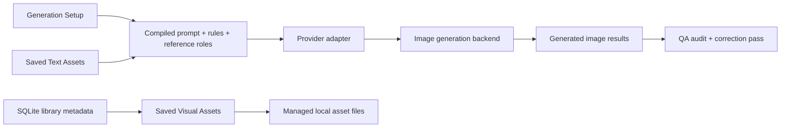

# local-ai-brand-studio

Local-first, reference-driven AI content studio for building brand-consistent image prompts, managing reusable assets, and generating character-based visual content.

## Overview

Most AI image tools are great at novelty and weak at maintaining brand consistency.

This project is an attempt to close that gap.

`local-ai-brand-studio` is a local creative tool designed to:

- organize a reusable brand asset library
- structure prompt inputs instead of throwing references into one pile
- preserve character integrity across generations
- keep images and workspace data local-first
- support high-quality prompt engineering that can outlive any single model vendor

Core idea:

> Pick the right references, prompt with intent, preserve the brand system, and make image generation feel more like a real production workflow than a one-off experiment.

## What This Project Demonstrates

This repo is especially relevant for:

- applied AI product thinking
- prompt engineering as system design
- multimodal UX for reference-driven generation
- local-first asset management
- human-in-the-loop content tooling
- frontend and backend coordination in AI workflows

## Core Capabilities

### Visual Asset Library

- Backgrounds
- Character Sheets
- Character Scenes
- Characters
- Badges
- Textures & Patterns
- Logos

### Text Asset Library

- Prompt Starters
- Camera Framing Presets
- Pose & Action Presets

### Features

- clickable thumbnail-based generation inputs
- multi-character scene selection
- multi-background reference blending
- local managed-file storage for visual assets
- local workspace persistence plus backup
- role-aware backend prompt construction
- model-agnostic generation architecture with an OpenAI adapter used for current testing
- QA audit and correction flow for generated outputs

## Product Design Approach

This is not just a prompt form.

The app separates the workflow into 3 distinct jobs:

1. Build the scene
2. Review and generate
3. Manage the underlying asset system

That separation matters because creative tools break down quickly when generation controls, library administration, and review outputs are all mixed together.

## Technical Highlights

### 1. Role-Aware Prompt Construction

The backend does not treat all references equally.

It distinguishes between:

- character sheets
- characters
- character scenes
- primary backgrounds
- additional background blend references
- badges
- textures and patterns
- logos
- text presets such as framing and pose

Each element is injected into prompts with intent, not just presence.

### 2. QA Audit And Correction Loop

Generated images are not treated as automatically acceptable.

The current pipeline includes:

- a QA audit pass against the selected canonical references
- explicit identity checks for facial-system drift, hand-digit failures, silhouette drift, and other character-rule violations
- a correction pass that attempts to repair flagged outputs while preserving the successful parts of the scene

This makes failures more visible, improves iteration, and creates a foundation for provider-specific quality control across future image backends.

### 3. Brand Guidance As Active Input

Brand rules are not passive documentation.

The system reads [`CODEX.md`](./CODEX.md) and injects that guidance directly into generation so outputs reflect:

- visual system rules
- character language
- quality standards

### 4. Character Integrity Focus

The app is designed around the idea that details matter:

- face language
- hand style
- body shape
- accessories
- outfit logic
- silhouette consistency

This is especially important for collectible and character-driven brands where “close enough” usually fails.

### 5. Local-First Asset Handling

Instead of keeping large visual assets trapped in browser storage, saved files are written into an app-managed local folder and referenced from there.

That improves:

- original image quality preservation
- performance
- scale
- storage reliability

### 6. Product Thinking Over Demo Thinking

This project intentionally moves beyond “AI demo app” design.

Key UX considerations:

- searchable asset browsers
- pop-out editing flows
- compact library views
- reusable text presets
- clear separation between generation and management

## Stack

- Next.js
- React
- TypeScript
- Tailwind CSS
- OpenAI API for the current adapter
- local filesystem persistence via Next.js route handlers
- SQLite library metadata management

## Architecture At A Glance

High-level flow:



For the fuller system overview, see [ARCHITECTURE.md](./ARCHITECTURE.md).

## Repository Structure

```text
app/
  api/
    assets/route.ts        # save/delete managed visual assets
    generate/route.ts      # compile prompts, call provider adapter, run QA
    library/route.ts       # load/save SQLite-backed library metadata
    workspace/route.ts     # load/save session state
  page.tsx                 # main product UI
lib/
  library-db.ts            # SQLite library access
public/
  managed-library/assets/  # app-managed saved image files (gitignored)
data/                      # local runtime data (gitignored)
CODEX.md                   # brand guidance used by generation
ARCHITECTURE.md            # system overview and diagrams
```

## Local Development

### Requirements

- Node.js
- npm
- an OpenAI API key for the current adapter

### Setup

1. Install dependencies:

```bash
npm install
```

2. Create `.env.local`:

```env
OPENAI_API_KEY=your_api_key_here
OPENAI_TEXT_MODEL=gpt-5.5
```

3. Start the app:

```bash
npm run dev
```

4. Open:

```text
http://localhost:3000
```

## Current Status

This is an active working product build, not a polished SaaS launch.

What is already strong:

- local-first library direction
- structured prompt assembly
- reusable reference and preset systems
- thoughtful UX iteration around asset scale and generation flow

What still needs hardening:

- deeper model-agnostic provider adapter support
- stronger identity-fidelity enforcement across image backends
- export/import backups
- broken-file health checks
- richer debugging visibility into generation payloads and QA results

## Why This Matters For AI Product Work

A lot of AI tooling fails because it focuses only on model output and ignores workflow quality.

This project focuses on the systems around the model:

- how assets are organized
- how prompts are assembled
- how references are weighted
- how consistency is preserved
- how local creative work stays usable over time

That is the kind of work required to make AI useful in actual production environments.

## Future Development

This project is evolving toward a more complete multimodal content system beyond static image generation.

- video, GIF, and meme generation from structured scene inputs
- integrated audio workflows aligned with content and tone
- character-driven script and narrative generation for consistent storytelling
- cross-modal workflows combining image, video, audio, and text into unified outputs
- advanced character systems with persistent identity and multi-character interaction

Goal: evolve from a prompt-based tool into a fuller AI-assisted content production system for scalable, brand-consistent creative work.

## Credits And Usage Notes

- Made using the GVC Builder Kit
- Personal-use project
- Not officially approved or endorsed by Good Vibes Club
- Respect the original kit’s usage terms and visible credit requirements
