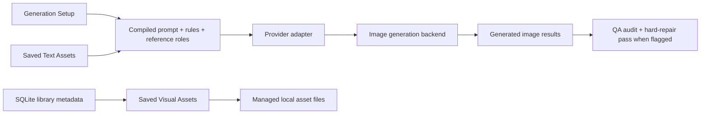

# local-ai-brand-studio

> Local-first AI creative infrastructure for building consistent, character-driven content systems.

A reference-driven AI content studio for creators, collectible brands, NFT ecosystems, and visual storytelling workflows that need more than random prompt experimentation.

Built using the GVC Builder Kit and shaped around a simple idea:

> AI generation becomes much more useful when creative systems are treated like production workflows instead of one-off prompts.

## Why This Exists

Most AI image tools are optimized for novelty.

Very few are optimized for:

- character consistency
- reusable visual systems
- scalable creative workflows
- persistent creative direction
- long-term brand integrity

That becomes a real problem for:

- NFT collections
- character universes
- creator brands
- indie game concepts
- meme ecosystems
- AI-native media projects

Because "close enough" usually fails.

`local-ai-brand-studio` was built to explore a different direction:

> structured, reusable, local-first AI-assisted creative workflows.

## Core Philosophy

### 1. Creative systems matter more than individual prompts

Prompts are temporary.

Systems scale.

This project is designed to build reusable creative infrastructure:

- asset libraries
- prompt systems
- scene-building workflows
- character rules
- reusable framing and pose presets
- QA audit and repair behavior
- persistent local creative state

### 2. Models will continue to change

The workflow should survive model changes.

This app is intentionally model-aware at the adapter layer and model-agnostic at the workflow layer.

Today it supports multiple provider adapters in the same UI, and it is designed so future adapters can be added without rebuilding the whole product around one vendor.

The goal is not to lock creativity to a single model.

The goal is to preserve the workflow.

### 3. Local-first ownership matters

Creative assets should stay under the creator's control.

This project keeps, whenever possible:

- visual references
- workspace state
- reusable assets
- generation systems

stored locally on the creator's machine.

That improves:

- control
- reliability
- image preservation
- workflow durability
- long-term maintainability

## What The App Actually Does

The app combines:

- structured scene building
- reusable reference systems
- role-aware prompt construction
- local asset management
- reusable text presets
- QA audit and hard-repair behavior
- multi-provider image generation

into one creative workflow.

Instead of treating generation like a single prompt box, the system separates the job into three distinct areas:

1. Build the scene
2. Review and generate
3. Manage the underlying creative system

That separation becomes more important as projects scale.

## Creative Workflow Features

### Visual Asset Library

Manage reusable visual systems including:

- Character Sheets
- Characters
- Character Scenes
- Backgrounds
- Logos
- Badges
- Textures & Patterns

### Reusable Text Assets

Save and reuse structured creative direction including:

- Prompt Starters
- Camera Framing Presets
- Pose & Action Presets

This makes it possible to build modular workflows instead of rewriting creative direction from scratch every session.

### Role-Aware Prompt Construction

The backend does not treat all references equally.

A character sheet should not be weighted the same way as:

- a background
- a character scene
- a badge
- a texture reference
- a framing preset
- a pose preset

The app assembles prompts intentionally based on reference role and creative purpose.

The result is meant to feel less like chatting with an AI and more like directing a small production workflow.

### QA Audit And Hard Repair

Generated outputs are not treated as automatically successful.

The current pipeline includes:

- one QA audit pass against selected references
- explicit identity checks for facial-system drift, hand-digit failures, silhouette drift, and related character-rule violations
- a hard-repair generation pass when the audit flags critical identity failures

The goal is not to pretend failures do not happen.

The goal is to make failures visible, inspectable, and more repairable.

## Why This Matters

A lot of AI tooling focuses almost entirely on model output quality.

This project focuses on the systems around the model:

- how references are organized
- how creative direction is preserved
- how reusable workflows are constructed
- how local creative work scales over time
- how creators maintain control over identity and style

That is the kind of infrastructure required to make AI genuinely useful for long-term creative production.

## Built For More Than One Brand

This project was originally developed using the Good Vibes Club Builder Kit and follows GVC-inspired workflow principles around identity consistency, reference hierarchy, and scene discipline.

But the larger idea extends beyond a single collection.

The workflow could be adapted for:

- collectible projects
- creator brands
- character franchises
- indie game worlds
- meme projects
- AI-assisted animation concepts
- visual storytelling systems

Any project with a strong visual identity can benefit from structured AI creative workflows.

## Current Status

This is an active working product build, not a polished SaaS launch.

What is already strong:

- local-first library direction
- structured prompt assembly
- reusable reference and preset systems
- multi-provider image model selection
- thoughtful UX separation between generation and management
- growing QA visibility into generation failures

What still needs hardening:

- stronger identity-fidelity enforcement across image backends
- deeper provider-specific QA tuning
- export/import backups
- broken-file health checks
- richer debugging visibility into generation payloads and repair behavior

## Stack

- Next.js
- React
- TypeScript
- Tailwind CSS
- SQLite library metadata management
- local filesystem persistence via Next.js route handlers
- OpenAI adapters for current testing
- Google Gemini adapters for current testing

## Architecture At A Glance

High-level flow:



For the fuller system overview, see [ARCHITECTURE.md](./ARCHITECTURE.md).

## Repository Structure

```text
app/
  api/
    assets/route.ts        # save/delete managed visual assets
    generate/route.ts      # compile prompts, call provider adapter, run QA
    image-models/route.ts  # discover configured image models for the UI
    library/route.ts       # load/save SQLite-backed library metadata
    workspace/route.ts     # load/save session state
  page.tsx                 # main product UI
lib/
  image-models.ts          # provider/model registry
  library-db.ts            # SQLite library access
public/
  managed-library/assets/  # app-managed saved image files (gitignored)
data/                      # local runtime data (gitignored)
CODEX.md                   # brand guidance used by generation
ARCHITECTURE.md            # system overview and diagrams
```

## Local Development

### Requirements

- Node.js
- npm
- at least one compatible image-provider API key

### Setup

1. Install dependencies:

```bash
npm install
```

2. Create `.env.local`:

```env
OPENAI_API_KEY=your_api_key_here
OPENAI_TEXT_MODEL=gpt-5.5
GEMINI_API_KEY=your_key_here
```

You only need keys for the providers you want to use.

The app detects available image models from configured provider keys and lets you choose between them in the UI.

3. Start the app for development:

```bash
npm run dev
```

4. Open:

```text
http://localhost:3000
```

For more stable real-world local use, build and run the production server:

```bash
npm run build
npm run start
```

## Why This Project Is Relevant To AI Product Work

Many AI tools fail because they focus only on model output and ignore workflow quality.

This project focuses on the systems around the model:

- how assets are organized
- how prompts are assembled
- how references are weighted
- how consistency is preserved
- how local creative work stays usable over time

That is the kind of work required to make AI useful in real production environments.

## Future Direction

The long-term direction extends beyond static image generation.

Likely exploration areas include:

- video and GIF workflows
- meme systems built from structured scene inputs
- integrated audio workflows aligned with tone and content
- character-driven scripting and storytelling support
- broader multimodal workflows combining image, video, audio, and text

The larger goal is to evolve toward a creator-owned AI production system for scalable visual storytelling.

## Credits And Usage Notes

- Made using the GVC Builder Kit
- Reference: [brydisanto/gvc-builder-kit](https://github.com/brydisanto/gvc-builder-kit)
- Personal-use project
- Not officially approved or endorsed by Good Vibes Club
- Respect the original Builder Kit's usage terms and visible credit requirements

## Final Thought

AI models will continue changing rapidly.

Creative systems are what last.

If you are building worlds, characters, brands, or visual storytelling workflows, I hope this project gives you ideas for building something more durable than a single prompt.
