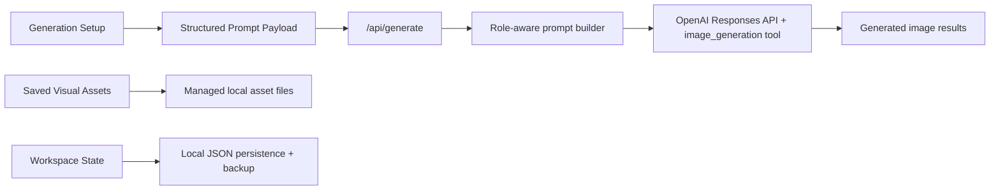

# GVC Content Studio

Local-first, reference-driven AI content studio for building brand-consistent image prompts around reusable characters, scenes, and visual systems.

> Built using The Playground and the GVC Builder Kit.  
> Personal-use project. Not officially approved or endorsed by Good Vibes Club.

## Why I Built This

Most AI image tools are great at generating novelty and weak at maintaining brand consistency.

This project is an attempt to close that gap.

`GVC Content Studio` is a local creative tool designed to:

- organize a reusable brand asset library
- structure prompt inputs instead of throwing references into one pile
- preserve character integrity across generations
- keep images and workspace data local-first
- support high-quality prompt engineering that can outlive any single model vendor

The product idea is simple:

Pick the right references, prompt with intent, preserve the brand system, and make image generation feel more like a real production workflow than a one-off experiment.

## What This Project Demonstrates

This repo is especially relevant for recruiters, AI companies, and product teams interested in:

- applied AI product thinking
- prompt engineering as system design
- multimodal UX for reference-driven generation
- local-first asset management
- human-in-the-loop content tooling
- frontend and backend coordination in AI workflows

## Core Capabilities

- Visual asset library with classification by:
  - `Backgrounds`
  - `Character Scenes`
  - `Characters`
  - `Badges`
  - `Textures & Patterns`
  - `Logo`
- Text asset library for:
  - `Prompt Starters`
  - `Camera Framing Presets`
  - `Pose & Action Presets`
- Clickable thumbnail-based generation inputs
- Multi-character scene selection
- Multi-background reference blending
- Local managed-file storage for saved visual assets
- Local workspace persistence with backup
- Role-aware backend prompt construction
- OpenAI-powered image generation with a model-agnostic prompt strategy

## Product Design Approach

This is not just a prompt form.

The app separates the workflow into 3 distinct jobs:

1. Build the scene.
2. Review and generate.
3. Manage the underlying asset system.

That separation matters because creative tools break down quickly when generation controls, library administration, and review outputs are all mixed together.

## Technical Highlights

### 1. Role-Aware Prompt Construction

The generation backend does not treat all references equally.

It distinguishes between:

- primary background
- additional background blend references
- characters
- character scenes
- badges
- textures and patterns
- logos
- text presets such as framing and pose

This creates a better prompt package for any image model because each reference is passed with intent, not just presence.

### 2. Brand Guidance As Active Input

Brand rules are not hidden in a doc nobody reads.

The backend reads [`CODEX.md`](./CODEX.md) and injects that guidance into the generation pipeline so the visual system, character language, and quality rules influence every request.

### 3. Character Integrity Matters

The app is designed around the idea that details matter:

- face language
- hand style
- body shape
- accessories
- outfit logic
- silhouette consistency

That is especially important for collectible, character-driven brands where “close enough” usually fails.

### 4. Local-First Asset Handling

Instead of keeping large visual assets trapped in browser storage, saved files are written into an app-managed local folder and referenced from there.

That improves:

- original image quality preservation
- performance
- scale
- storage reliability

### 5. Product Thinking Over Demo Thinking

This project is intentionally moving beyond “AI demo app” territory.

The design choices are aimed at real usability:

- searchable asset browsers
- pop-out editing flows
- compact library views
- reusable text presets
- clear separation between generation and management

## Stack

- `Next.js 14`
- `React 18`
- `TypeScript`
- `Tailwind CSS`
- `OpenAI API`
- local filesystem persistence through Next.js route handlers

## Architecture At A Glance

High-level flow:



For the full architecture and prompt-flow diagrams, see [ARCHITECTURE.md](./ARCHITECTURE.md).

## Repository Structure

```text
app/
  api/
    assets/route.ts        # save/delete managed visual assets
    generate/route.ts      # build prompts and call OpenAI
    workspace/route.ts     # load/save workspace state
  page.tsx                 # main product UI
public/
  managed-library/assets/  # app-managed saved image files
data/
  workspace.json           # primary workspace persistence
  workspace.backup.json    # backup workspace persistence
CODEX.md                   # brand guidance used by generation
ARCHITECTURE.md            # system overview and diagrams
```

## Local Development

### Requirements

- Node.js
- npm
- an OpenAI API key

### Setup

1. Install dependencies:

```bash
npm install
```

2. Create `.env.local`:

```env
OPENAI_API_KEY=your_api_key_here
OPENAI_TEXT_MODEL=gpt-5.5
```

3. Start the app:

```bash
npm run dev
```

4. Open:

```text
http://localhost:3000
```

## Current Status

This is an active working product build, not a polished SaaS launch.

What is already strong:

- local-first library direction
- structured prompt assembly
- reusable reference and preset systems
- thoughtful UX iteration around asset scale and generation flow

What still needs hardening:

- export/import backups
- broken-file health checks
- more debugging visibility into generated prompt payloads
- deeper model-agnostic tuning across multiple image backends

## Why This Matters For AI Product Work

A lot of AI tooling fails because it focuses only on model output and ignores workflow quality.

This project focuses on the systems around the model:

- how assets are organized
- how prompts are assembled
- how references are weighted
- how consistency is preserved
- how local creative work stays usable over time

That is the kind of work required to make AI useful in actual production environments.

## Roadmap

- export/import library snapshots
- asset health and broken-reference checks
- prompt-debug view for generation transparency
- richer multi-character scene orchestration
- support for additional image generation backends
- stronger content workflows beyond images alone

## Credits And Usage Notes

- Made using the GVC Builder Kit
- Personal-use project
- Not affiliated with or endorsed by Good Vibes Club
- Respect the original kit’s usage terms and visible credit requirements

