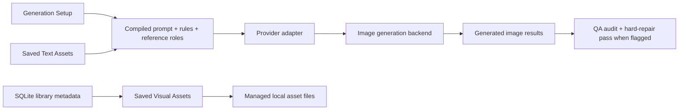

# local-ai-brand-studio

> Local-first AI creative infrastructure for building consistent, character-driven content systems.

A reference-driven AI content studio for creators, collectible brands, NFT ecosystems, and visual storytelling workflows that need more than random prompt experimentation.

Built using the GVC Builder Kit and shaped around a simple idea:

> AI generation becomes much more useful when creative systems are treated like production workflows instead of one-off prompts.

Current documented version: `0.5.0`

Release notes: [CHANGELOG.md](./CHANGELOG.md)

## Why This Exists

Most AI image tools are optimized for novelty.

Very few are optimized for:

- character consistency
- reusable visual systems
- scalable creative workflows
- persistent creative direction
- long-term brand integrity

That becomes a real problem for:

- NFT collections
- character universes
- creator brands
- indie game concepts
- meme ecosystems
- AI-native media projects

Because "close enough" usually fails.

`local-ai-brand-studio` explores a different direction:

> structured, reusable, local-first AI-assisted creative workflows.

## Quick Start

If you just want to get the app running locally, start here.

### Before you begin

Make sure you have:

- Node.js
- npm
- at least one supported image provider account
- a valid API key for the provider you want to use

Current supported providers in this repo:

- OpenAI
- Google Gemini

This repo is designed to support future adapter expansion, but local-model adapters are not currently documented as an out-of-the-box setup path in this build.

There are no other installable app dependencies beyond `npm install` for this repo itself.

What you do need beyond `npm install` is provider access:

- for OpenAI, create an API key in the OpenAI platform
- for Gemini, create an API key in Google AI Studio

Official references:

- OpenAI API quickstart: [platform.openai.com/docs/quickstart/authentication](https://platform.openai.com/docs/quickstart/authentication)
- Gemini API keys: [ai.google.dev/gemini-api/docs/api-key](https://ai.google.dev/gemini-api/docs/api-key)

### 1. Clone the repository

```bash
git clone https://github.com/CharisTheAI/local-ai-brand-studio.git
cd local-ai-brand-studio
```

### 2. Install app dependencies

This installs the app's JavaScript and build dependencies:

```bash
npm install
```

After that, the remaining setup is provider access, not additional local package installation.

### 3. Create `.env.local`

Create a file named `.env.local` in the project root.

Example:

```env
OPENAI_API_KEY=your_openai_key_here
OPENAI_TEXT_MODEL=gpt-5.5
GEMINI_API_KEY=your_gemini_key_here
```

You only need keys for the providers you actually want to use.

These examples are for the providers currently supported in this repo today.

### 4. Start the app

For development and active UI/code work:

```bash
npm run dev
```

Then open:

```text
http://localhost:3000
```

## Best Way To Run It For Real Local Use

If you are actually using the app for creative work, use the production server instead of the dev server.

### Development mode

```bash
npm run dev
```

Use this when:

- changing UI/code
- iterating quickly
- debugging frontend behavior

Be aware:

- dev mode can be less stable
- hot reload and CSS loading can occasionally get flaky

### Stable local use

```bash
npm run build
npm run start
```

Use this when:

- actually generating content
- reviewing results
- managing your asset library over longer sessions

If you change the code while using `npm run start`, rebuild before launching again.

## Requirements

- Node.js
- npm
- at least one supported image-provider API key or provider account with valid access

## Provider Setup

The app is workflow-first and provider-flexible.

Today the UI can detect configured providers and expose available image models automatically.

Current provider support in this build includes:

- OpenAI image adapters
- Google Gemini image adapters

This README does not currently document a local-model adapter setup path because that is not yet exposed as a supported out-of-the-box option in this repo.

How it works:

- if a provider key is present in `.env.local`, that provider's supported image models can appear in the `Image Model` dropdown
- if a provider key is missing, those models will not appear
- you do not need to configure providers you are not using

Example `.env.local`:

```env
OPENAI_API_KEY=your_openai_key_here
OPENAI_TEXT_MODEL=gpt-5.5
GEMINI_API_KEY=your_gemini_key_here
```

## First Launch Workflow

Once the app is running, the easiest way to understand it is:

1. Open the app locally
2. Choose an `Image Model`
3. Go to `Asset Library Manager`
4. Upload character sheets, character references, backgrounds, scenes, or detail references
5. Save those assets into the local library
6. Return to `Generation Setup`
7. Select the visual references you want to use
8. Choose prompt, camera, pose, and output settings
9. Generate an image
10. Inspect the result and review the audit panel if the output drifts from the intended character rules

## What The App Actually Does

The app combines:

- structured scene building
- reusable reference systems
- role-aware prompt construction
- local asset management
- reusable text presets
- QA audit and hard-repair behavior
- multi-provider image generation

Instead of treating generation like a single prompt box, the system separates the job into three distinct areas:

1. Build the scene
2. Review and generate
3. Manage the underlying creative system

This provides better scalability.

## Creative Workflow Features

### Visual Asset Library

Manage reusable visual systems including:

- Character Sheets
- Characters
- Character Scenes
- Backgrounds
- Logos
- Badges
- Textures & Patterns

### Reusable Text Assets

Save and reuse structured creative direction including:

- Prompt Starters
- Camera Framing Presets
- Pose & Action Presets

This makes it possible to build modular workflows instead of rewriting creative direction from scratch every session.

### Role-Aware Prompt Construction

The backend does not treat all references equally.

A character sheet should not be weighted the same way as:

- a background
- a character scene
- a badge
- a texture reference
- a framing preset
- a pose preset

The app assembles prompts intentionally based on reference role and creative purpose.

The result is meant to feel less like chatting with an AI and more like directing a small production workflow.

### QA Audit And Hard Repair

Generated outputs are not treated as automatically successful.

The current pipeline includes:

- one QA audit pass against selected references
- explicit identity checks for facial-system drift, hand-digit failures, silhouette drift, and related character-rule violations
- a hard-repair generation pass when the audit flags critical identity failures

The goal is to make failures visible, inspectable, and more repairable.

## Local Data And Persistence

This project is designed around local-first use.

Important local runtime paths include:

- `public/managed-library/assets/`
  - app-managed saved image files
- `data/`
  - local runtime data and metadata

These paths are gitignored in normal use.

That means:

- your working assets stay local
- your runtime data is not meant to be committed by default
- the repo is intended as an installable app base, not a dump of your personal generation history

## Troubleshooting

### No image models appear in the dropdown

Check:

- `.env.local` exists
- the provider key is present and valid
- you restarted the app after editing `.env.local`

### The app loads but looks unstyled

I am not fully certain this will happen in every environment, but during local use the dev server can sometimes behave inconsistently with styling or hot reload.

Best fix:

```bash
npm run build
npm run start
```

If you are using `npm run dev`, try:

- a hard refresh
- restarting the dev server

### A provider works, but the model is missing

Check:

- the correct provider key is configured
- the app was restarted after env changes
- that provider/model is supported in the current adapter registry

### Generation feels unstable

For more stable actual use:

```bash
npm run build
npm run start
```

### My saved assets are not in GitHub

That is expected for normal use.

Local library files and runtime data are intentionally kept in gitignored directories so creators can work locally without publishing their private working library.

## Built For More Than One Brand

This project was originally developed using the Good Vibes Club Builder Kit and follows GVC-inspired workflow principles around identity consistency, reference hierarchy, and scene discipline.

But the larger idea extends beyond a single collection.

The workflow could be adapted for:

- collectible projects
- creator brands
- character franchises
- indie game worlds
- meme projects
- AI-assisted animation concepts
- visual storytelling systems

Any project with a strong visual identity can benefit from structured AI creative workflows.

## Current Status

This is an active working product build, not a polished SaaS launch.

Current strengths:

- local-first library direction
- structured prompt assembly
- reusable reference and preset systems
- multi-provider image model selection
- thoughtful UX separation between generation and management
- growing QA visibility into generation failures

Current documented version:

- `0.5.0`

This version number reflects a real working build that still needs broader testing, continued correction, and more provider-specific tuning.

## Stack

- Next.js
- React
- TypeScript
- Tailwind CSS
- SQLite library metadata management
- local filesystem persistence via Next.js route handlers
- OpenAI adapters for current testing
- Google Gemini adapters for current testing

## Architecture At A Glance

High-level flow:



For the fuller system overview, see [ARCHITECTURE.md](./ARCHITECTURE.md).

## Repository Structure

You do not need to understand the full repository structure to run the app, but this is the current high-level layout:

```text
app/
  api/
    assets/route.ts        # save/delete managed visual assets
    generate/route.ts      # compile prompts, call provider adapter, run QA
    image-models/route.ts  # discover configured image models for the UI
    library/route.ts       # load/save SQLite-backed library metadata
    workspace/route.ts     # load/save session state
  page.tsx                 # main product UI
lib/
  image-models.ts          # provider/model registry
  library-db.ts            # SQLite library access
public/
  managed-library/assets/  # app-managed saved image files (gitignored)
data/                      # local runtime data (gitignored)
CODEX.md                   # brand guidance used by generation
ARCHITECTURE.md            # system overview and diagrams
```

## Release Notes

Release notes now live in [CHANGELOG.md](./CHANGELOG.md).

## Future Direction

The long-term direction extends beyond static image generation.

Likely exploration areas include:

- video and GIF workflows
- meme systems built from structured scene inputs
- integrated audio workflows aligned with tone and content
- character-driven scripting and storytelling support
- broader multimodal workflows combining image, video, audio, and text

The larger goal is to evolve toward a creator-owned AI production system for scalable visual storytelling.

## Credits And Usage Notes

- Made using the GVC Builder Kit
- Reference: [brydisanto/gvc-builder-kit](https://github.com/brydisanto/gvc-builder-kit)
- Personal-use project
- Not officially approved or endorsed by Good Vibes Club
- Respect the original Builder Kit's usage terms and visible credit requirements

## Final Thought

AI models will continue changing rapidly.

Creative systems are what last.

If you are building worlds, characters, brands, or visual storytelling workflows, I hope this project gives you ideas for building something more durable than a single prompt.
